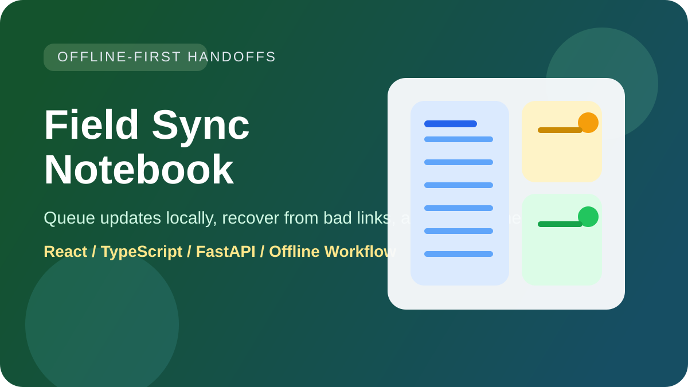
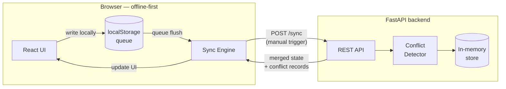

# Field Sync Notebook

[](https://github.com/RedBeret/field-sync-notebook/actions/workflows/ci.yml)



An offline-first field notes and handoff tool for operators working with spotty connectivity and shifting teams.

The problem is straightforward: you're on shift, you're three bars of signal from nowhere, and the next operator needs to know what you actually found — not what you think you told them, not what the whiteboard said two hours ago, but what's actually going on right now. Field Sync Notebook keeps notes, tasks, and attachments in sync across reconnects, and surfaces conflicts when the same record gets edited on both ends.

## Quick Start

```bash
# Windows
run.bat

# Linux / macOS
bash start.sh
```

Backend: http://127.0.0.1:8030  
Frontend: http://localhost:5173

## How It Works

### Opening a shift

You open the notebook. The workspace catalog shows you what's active. Your previous shift's handoff summary is right there — what was flagged, what's in progress, what the outstanding issues are. You don't have to find someone to ask.

### Making notes in the field

You create field notes, add tasks, attach photos. Everything writes locally first. You see a sync status badge on each item: synced, pending, or conflict. Pending means it's queued, waiting for connectivity.

Signal drops. You keep working. Notes stay local, queued up. Nothing is lost.

### Syncing

You get signal back. You hit Sync. The app pushes your local queue to the server and pulls any changes from teammates. Most of the time it just works — your notes land, their notes land, everyone is current.

### The conflict

Sometimes both ends edit the same note. Maybe you updated the tank pressure reading at 14:00, and your teammate on the other shift did too — from a different location, with different info. When you sync, Field Sync Notebook shows you the conflict: both versions, side by side, with timestamps.

You read both. You pick the right one, or you merge the details. You resolve it and move on. No lost data, no guessing.

### Handing off

At shift end, you generate a handoff summary — a clean export of your notes, tasks, and open conflicts. The next person opens their shift with a full picture.

## Architecture



Every write lands in the browser's localStorage queue before touching the network. The sync trigger is manual — polling on degraded signal wastes bandwidth and creates noise. On sync, the server compares the client's last-known-good state against current server state and returns conflict records for any simultaneous edits. The browser displays both versions side by side and waits for the operator to resolve before committing.

**Stack:** React + TypeScript (Vite) · FastAPI · Python 3.12

## Features

- Workspace catalog with per-item sync state (synced / pending / conflict)
- Offline-first notes and tasks with localStorage queue
- Conflict detection and resolution UI — both versions shown, pick or merge
- Manual sync with connection-mode awareness
- Exportable handoff summary

## Case Study: Simultaneous Pressure Readings, Zero Data Loss

**Situation.** Two operators on overlapping shifts update the same tank pressure reading — one at 14:00 from the pump room, one at 14:03 from the control van — both offline when they write. When they sync at 14:15, the system has two conflicting values for the same record.

**Constraints.** Last-write-wins would silently discard one reading. An optimistic lock would block the second write entirely. Neither works for field ops where the right answer might be the later reading, the earlier one, or a merge of both observations.

**Architecture choice.** The sync engine stores the client's `last_synced_at` timestamp with every queued op. On flush, the server checks each record's server-side `updated_at` against the client's baseline. If the server version moved after the client's last sync, the op becomes a conflict rather than a write.

**What the operator sees.** A conflict badge on the pressure record. Opening it shows: version A (14:00, pump room) and version B (14:03, control van) with author and timestamp on each. The operator reads both, picks the 14:03 reading as authoritative (higher pressure, later instrument read), and resolves. The resolved value commits to the server and clears the queue.

**Result.** No data loss. The decision is logged with the operator's name and timestamp. The handoff summary that goes to the next shift includes the resolved reading and the fact that a conflict was present — full audit trail.

All data in this example is synthetic.

## Local Development

**Backend**

```bash
cd backend
python -m venv .venv
.venv\Scripts\activate        # Windows
source .venv/bin/activate     # Linux / macOS
pip install -r requirements.txt
uvicorn app.main:app --reload --port 8030
```

**Frontend**

```bash
cd frontend
npm install
npm run dev
```

## Verification

```bash
# Backend tests
cd backend && python -m unittest discover -s tests -v

# Frontend build
cd frontend && npm run build
```

## Requirements

- Python 3.12+
- Node 22+
- npm

## License

MIT. See `LICENSE`.
